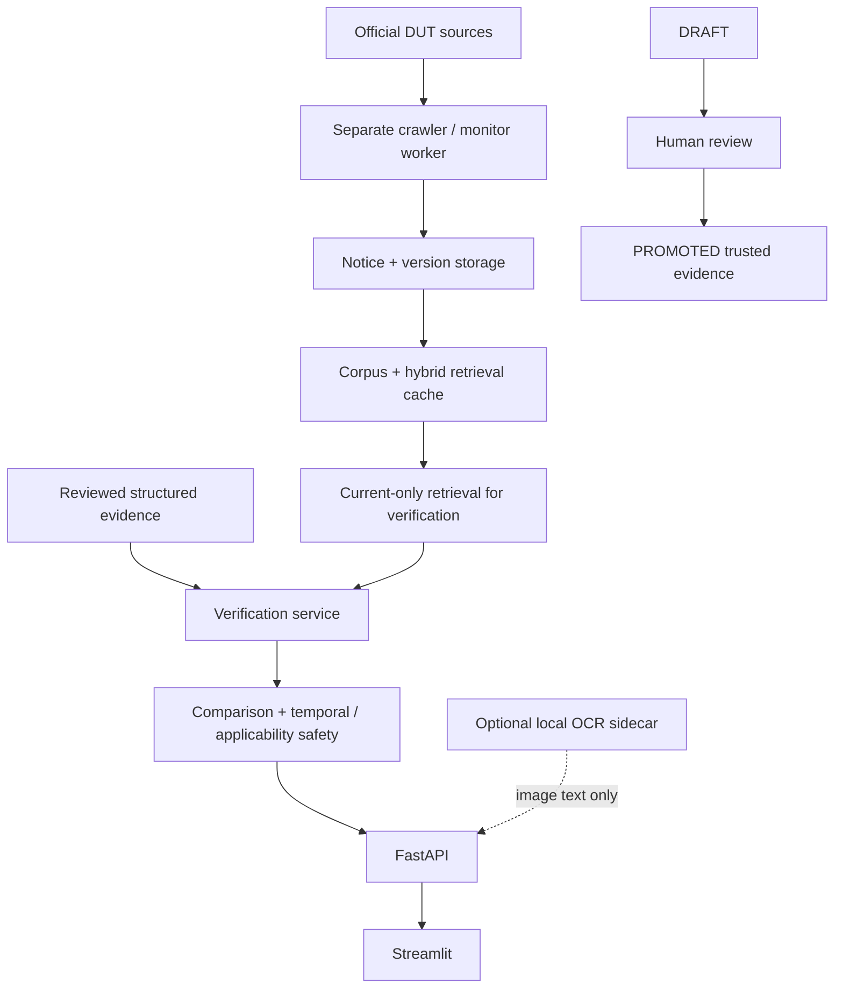

# UniTrust AI

UniTrust là hệ thống hỗ trợ sinh viên kiểm chứng thông tin đại học dựa trên
nguồn chính thức: thu thập thông báo, theo dõi phiên bản, tìm bằng chứng phù
hợp và đối chiếu các trường thông tin đã được đánh giá. Đây **không phải** là
chatbot hỏi đáp tổng quát.

> Kiểm chứng đúng nguồn, an tâm hành động.

## 1. Mục tiêu

Thông báo đại học thường nằm ở nhiều nguồn, bị chuyển tiếp qua Zalo/Facebook,
có thể thiếu ngữ cảnh hoặc đã lỗi thời. UniTrust giúp sinh viên xác định:

- nguồn chính thức nào hỗ trợ thông tin;
- thông tin có áp dụng cho mình không;
- hạn, hành động hoặc khoản tiền có mâu thuẫn với bằng chứng hiện hành không;
- khi nào hệ thống phải dừng ở **Chưa đủ bằng chứng** thay vì suy đoán.

## 2. Chức năng hiện có

### Đã triển khai

- Thu thập nguồn DUT đã đăng ký, lưu thông báo và phiên bản lịch sử.
- Monitor độc lập phát hiện `NEW` / `UPDATED` / `UNCHANGED` và xuất bản lại
  retrieval cache khi có thay đổi đáng kể.
- Hybrid retrieval (BM25 + `multilingual-e5-small`) và current-only retrieval
  cho xác minh.
- Bằng chứng nghĩa vụ đã được con người review; xác minh văn bản, đối chiếu
  action/deadline/amount, temporal/applicability safety.
- Tra cứu bằng chứng, trang **Dành cho bạn**, và demo cases A/B/C.
- Xác minh ảnh qua OCR sidecar cục bộ tùy chọn.
- Vòng đời bằng chứng trung lập nhà cung cấp:
  `DRAFT → HUMAN REVIEW → PROMOTED`.

### Future / deferred

- Gemini/LLM không phải thành phần runtime demo và không tự tạo trusted
  evidence.
- Notice mới crawl không tự động trở thành nghĩa vụ đã review.
- `EventOccurrence` mới là schema; chưa có trích xuất/so sánh dẫn tới verdict.
- Chưa có scheduler/service luôn chạy sẵn.

## 3. Kiến trúc hệ thống



UniTrust chạy bằng các process thành phần: FastAPI backend, Streamlit frontend
và monitor worker cho continuous freshness. FastAPI và Streamlit không tự khởi
chạy monitor, và Streamlit rerun không crawl nguồn. OCR sidecar chỉ là thành
phần cục bộ bổ sung khi xác minh ảnh.

## 4. Continuous Freshness

Khi monitor đang chạy, nó tuần tự kiểm tra các nguồn chính thức đã đăng ký:

- cadence mặc định: **600 giây**;
- cadence nhỏ nhất: **300 giây**;
- phát hiện `NEW`, `UPDATED`, `UNCHANGED`, hoặc lỗi riêng theo từng nguồn;
- lưu phiên bản để lịch sử vẫn audit được;
- chỉ rebuild/publish retrieval cache khi có `NEW` hoặc `UPDATED`.

Nếu dừng terminal monitor, web UI vẫn chạy và dữ liệu hiện có vẫn sẵn sàng,
nhưng thu thập/cập nhật tự động sẽ dừng. Thu thập và versioning là tự động khi
worker đang chạy; **promotion thành trusted structured evidence không tự
động**.

## 5. Tech stack

- Python 3.13 (môi trường đã kiểm chứng: 3.13.15 trên Windows)
- FastAPI + Uvicorn
- Streamlit
- SQLite
- Pydantic
- BM25 và `sentence-transformers` với `multilingual-e5-small`
- pytest
- PaddleOCR/PaddlePaddle trong sidecar OCR cục bộ tùy chọn

`google-genai` có thể xuất hiện trong dependency qualification, nhưng Gemini
không phải dependency runtime bắt buộc của demo.

## 6. Cấu trúc thư mục

- `app/` — API, crawler, monitor, retrieval, xác minh và domain models.
- `frontend/` — Streamlit UI, client và demo cases.
- `scripts/` — preflight, launcher, monitor và OCR sidecar utilities.
- `data/` — annotations/catalog có chủ đích được version; raw/runtime data
  local không được commit.
- `evaluation/` — benchmark/evaluation artifacts đã được quản lý.
- `tests/` — regression và safety tests.
- `docs/` — runbook, kiến trúc và tài liệu demo.

## 7. Yêu cầu môi trường

- Windows là môi trường đã được kiểm chứng.
- Python **3.13** và Git.
- Dung lượng cục bộ cho E5 model snapshot; model snapshot không nằm trong Git.
- Một **demo runtime snapshot** gồm DB/retrieval cache được chuẩn bị từ team
  lead. Snapshot production/retrieval hiện bị bỏ qua khỏi Git để tránh commit
  runtime artifacts.

OCR là tùy chọn và cần isolated runtime riêng; xem phần OCR.

## 8. Clone repository

```powershell
git clone https://github.com/thongbin26/UniTrust.git
cd UniTrust
```

## 9. Tạo virtual environment

```powershell
python -m venv .venv
.\.venv\Scripts\Activate.ps1
python -m pip install --upgrade pip
pip install -r requirements.txt
```

Nếu PowerShell chặn activation, dùng Python trong `.venv\Scripts\python.exe`
trực tiếp hoặc làm theo chính sách execution policy của máy; không thay đổi
chính sách bảo mật toàn máy chỉ để chạy UniTrust.

## 10. Quick Start — Chạy UniTrust với external runtime

UniTrust là một hệ thống gồm backend, frontend và monitor worker chạy tách
process. Để monitor không ghi vào repository, dùng một runtime ngoài repo.
Nhận bundle demo snapshot (DB, retrieval cache và local E5 snapshot) qua kênh
nội bộ của team trước khi chạy. Git clone **không** tự mang theo các file
runtime lớn đó.

```powershell
$runtime = "$env:USERPROFILE\unitrust-demo-runtime"
$snapshot = "C:\path\provided-by-team-lead\unitrust-demo-snapshot"
New-Item -ItemType Directory -Force -Path $runtime | Out-Null

# Copy từ demo snapshot do team lead cung cấp; không copy ngược vào repo.
Copy-Item "$snapshot\unitrust-v2.db" "$runtime\unitrust-v2.db"
Copy-Item "$snapshot\retrieval" "$runtime\retrieval" -Recurse

$env:DATABASE_URL = "sqlite:///$($runtime.Replace('\', '/'))/unitrust-v2.db"
$env:RETRIEVAL_CACHE_DIR = "$runtime\retrieval"
$env:MONITORING_RAW_DATA_DIR = "$runtime\raw"
$env:MONITORING_ENABLED = "true"
$env:DENSE_LOCAL_FILES_ONLY = "true"
$env:HF_HUB_OFFLINE = "1"
$env:TRANSFORMERS_OFFLINE = "1"
```

`scripts/run_monitor.py` chỉ copy `--bootstrap-from` vào
`$runtime\unitrust-v2.db` khi DB đích chưa tồn tại. Bootstrap source phải là
một demo snapshot hợp lệ có source registry/notices; không dùng repository
runtime làm đích monitor.

Chạy preflight read-only sau khi thiết lập biến môi trường:

```powershell
.\.venv\Scripts\python.exe scripts\preflight_demo.py
```

## 11. Chạy Backend

Trong terminal đã thiết lập runtime:

```powershell
.\.venv\Scripts\python.exe -m uvicorn main:app --host 127.0.0.1 --port 8000
```

API mặc định ở `http://127.0.0.1:8000`.

## 12. Chạy Frontend

Mở terminal thứ hai, thiết lập cùng biến môi trường runtime (ít nhất
`API_BASE_URL=http://127.0.0.1:8000`), rồi chạy:

```powershell
$env:API_BASE_URL = "http://127.0.0.1:8000"
.\.venv\Scripts\python.exe -m streamlit run frontend\Home.py --server.address 127.0.0.1 --server.port 8501
```

Mở `http://127.0.0.1:8501`.

## 13. Chạy Continuous Monitor

Mở terminal thứ ba và dùng cùng `$runtime`:

```powershell
.\.venv\Scripts\python.exe scripts\run_monitor.py `
  --data-root $runtime `
  --interval-seconds 600 `
  --limit 3 `
  --bootstrap-from "$runtime\unitrust-v2.db"
```

Monitor giữ terminal này chạy cho tới khi nhấn `Ctrl+C`. Với một controlled
cycle, thêm `--once`. `--limit` giới hạn số detail notices cho mỗi source trong
một cycle; monitor không chấp nhận interval dưới 300 giây.

## 14. OCR — OPTIONAL

Text verification không cần OCR. OCR sidecar chỉ cần khi dùng image
verification; nó chạy loopback cục bộ trong một isolated Python runtime có
`requirements-ocr.txt`:

```powershell
<ocr-python> -m pip install -r requirements-ocr.txt
$env:UNITRUST_OCR_PYTHON = "<absolute-path-to-ocr-python.exe>"
.\scripts\start_ocr_sidecar.ps1
```

OCR models phải được chuẩn bị rõ ràng qua
`<ocr-python> -m scripts.prepare_ocr_models`; models/download caches không
được lưu trong Git. Nếu team chưa có OCR runtime/model bundle, bỏ qua image
verification và demo text vẫn hoạt động.

## 15. Demo cases

- **Case A — Đã xác minh:** nguồn reviewed chính xác hỗ trợ thông tin nhận
  được.
- **Case B — Có thông tin mâu thuẫn:** deadline `01/07/2026` là controlled,
  synthetic mutation của thông báo VEDC 2026 có reviewed source deadline
  `30/06/2026`.
- **Case C — Chưa đủ bằng chứng:** hệ thống abstain; không diễn giải là thông
  tin sai.

Chi tiết thao tác và lời thoại:
[docs/COMPETITION_DEMO_RUNBOOK.md](docs/COMPETITION_DEMO_RUNBOOK.md).

## 16. Chạy tests

```powershell
.\.venv\Scripts\python.exe -m pytest -q
```

Baseline repository mới nhất đã được kiểm chứng: **477 passed, 0 failed,
1 warning**. Đây là kết quả lịch sử đã xác minh, không phải bảo đảm cho mọi
máy sau này.

## 17. Trust & Safety design

- Bằng chứng luôn giữ official source provenance và liên kết version.
- Xác minh dùng current-only retrieval; historical versions vẫn audit được.
- Thiếu evidence phù hợp tạo abstention, không phải kết luận sai.
- Notice mới crawl không tự trở thành trusted evidence.
- Chỉ `DRAFT → human review → PROMOTED` mới cho phép structured evidence đi
  vào trusted verification boundary.

## 18. Current limitations

- Gemini qualification/runtime integration được hoãn.
- OCR có thể mất một số dấu tiếng Việt dù trường quan trọng vẫn có thể được
  giữ lại.
- Event/schedule schema chưa verdict-bearing.
- Monitor cần được chạy như process riêng.
- Notice mới cần review structured evidence trước khi xác minh trusted.
- Chưa cấu hình deployment scheduler/service.
- Một generalization retrieval miss đã biết có thể vẫn còn.

## 19. Team workflow

Với nhóm ba người, làm việc trên branch ngắn, nhỏ và review được:

```powershell
git pull origin main
git checkout -b feature/<ten-cong-viec>
# thay đổi nhỏ, test liên quan, review diff
git commit -m "<mô tả ngắn>"
git push -u origin feature/<ten-cong-viec>
```

Không commit `.env`, API keys, external runtime folders, model caches, OCR
models hoặc logs. Mở PR từ branch cá nhân về `main`; có thể dùng
`test/<ten-cong-viec>` thay cho `feature/<ten-cong-viec>` khi chỉ làm test.

## 20. Troubleshooting

- **Backend không lên:** kiểm tra `.venv`, `DATABASE_URL`, DB snapshot và port
  8000; chạy `scripts\preflight_demo.py` để đọc lỗi an toàn.
- **Streamlit không gọi được API:** đảm bảo backend ở port 8000 và
  `API_BASE_URL` đúng.
- **Thiếu Python dependency:** activate `.venv` rồi chạy
  `pip install -r requirements.txt`.
- **E5 cache thiếu/offline:** demo launcher dùng local-only; lấy local model
  snapshot đã chuẩn bị thay vì bật Hub download ngầm.
- **Monitor ghi sai nơi:** kiểm tra `--data-root`, `DATABASE_URL`, và
  `RETRIEVAL_CACHE_DIR` đều trỏ tới external runtime.
- **Port 8000/8501 bận:** xác định đúng process sở hữu port trước khi dừng;
  không dùng blanket process kill.
- **OCR sidecar unavailable:** kiểm tra `UNITRUST_OCR_PYTHON`, OCR
  dependencies/models, hoặc bỏ qua demo ảnh.

## 21. Project status

**Demo-ready UniTrust system.**

Công việc để sau demo: Gemini qualification/integration, cải thiện chất lượng
OCR, event extraction/comparison, retrieval miss tuning và deployment
scheduling.
